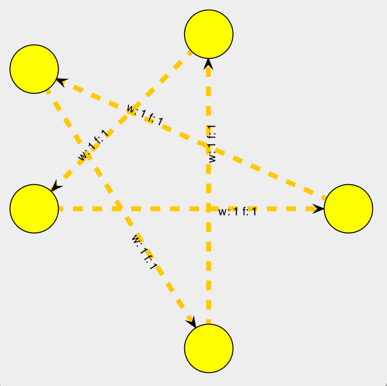

# GraphViewer

**GraphViewer** is a tool for **graph visualization** based on the JUNG framework, in the context of the **Algorithm Design and Analysis** course, at **FEUP**. It has been developed and mantained over the years by the course's Teaching Assistant students.

Here follows a tutorial on how students can **setup the CLion IDE and run an example project** with 3 different graphs loaded.

## Setting up the environment (CLion IDE)

1. Apply for a JetBrains Educational Pack using the link: https://www.jetbrains.com/shop/eform/students and using you upXXXXXXXXX@fe.up.pt, so that JetBrains identifies you as a real student.
2. Install CLion. Somewhere during the installation, you should be prompted to active you JetBrains account. Please insert the credentials you obtained in the previous step ("Get Licence From:" => "JB account")
3. Install a JDK (it is likely that you already have one)
4. If you are using Windows, you might need to setup an environment. You can find documentation on how to do it here: https://www.jetbrains.com/help/clion/quick-tutorial-on-configuring-clion-on-windows.html
5. For more details or other issues, please use https://www.jetbrains.com/help/clion/clion-quick-start-guide.html

## Running the example

1. Clone / Download this respository
2. Open CLion > Open > Choose the example dir in the repository

3. If you are under Windows, you'll need to add the sockets library to your CMakeLists.txt file. In that case, leave uncommented the line "link_libraries(ws2_32 wsock32)" Otherwise, if you are either under Linux or under MacOS, make sure that line is commented.

4. Run the project. You will the following three different graphs being loaded, in different windows

